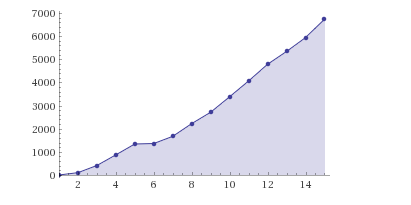
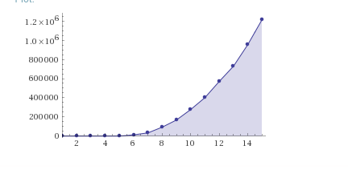
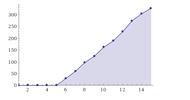

# Train Model

The purpose of the Train Model is to hold all related data about the train including speed, acceleration and deceleration. We use the Train Model to accurately track trains running on the track which provide finer granularity on a millimetre to millimetre basis.

## Calibrating the Train Model

The calibration of the train model includes live updates and offline calibrations. When doing offline calibrations, we specifically run through tests specialized to calculate the speed, stopping distance and acceleration distances of the train. 

Live updates are temporary for the running project. While the project runs, it accumulates values calculated sensor to sensor which correspond to a train travelling along the track.

We base stopping distance and acceleration distance on a train setting we deem with "zero-time" acceleration. We measure the total distance (sensor-to-sensor) and subtract the travel distance on our zero-time gear to find the acceleration distances.

## Interpolating the Data

By using the Lagrange Formula for interpolation, we can obtain an accurate continuous model which reflect the trains datapoints. Further more, we break down the train setting to a finer granularity (ie 0 - 140) which allows us to map the x, y measurements. We note that although lagrange can flucuate which may produce inaccurate results, tuning the upper and lower bounds allows us to obtain relevant information.

Furthermore, we've noticed linear trends on the acceleratio and deceleration timings which allows us to easily map between gear, velocity and acceleration without solving roots. This breakdown allows our model to behave closer to the real trains.





## Alpha Updates, Estimation and Standard Deviation

The Train Model can update its value based on real data as well. We use an alpha scale where alpha ~ 0.40 weighting influences the estimated model. We also use standard_deviation (or used to) to guard our datasets from outliers.

##Usage and Applications

Generally, the application uses the model to interpolate how far a train has gone into an acceleration. It also interpolates the distances travelled when there is no absolute train gear to be associated.

```c
int get_lagrange_basis(TrainModel *tm, int point, int x){
	int frac = tm->y[point];
	int i;
	for(i = 0; i < TRAIN_MODEL_SIZE; i++){
		if(i != point){
			frac *= (x - tm->x[i]);
			frac /= (tm->x[point] - tm->x[i]);
		}
	}
	
	return frac;
}


int interpolate(TrainModel *tm, int setting){
	int val = 0;
	int i;
	for(i = 0; i < TRAIN_MODEL_SIZE; i++){
		val += get_lagrange_basis(tm, i, setting);
	}
	return val;
}

int linear_interpolate(TrainModel *tm, int setting){
	int floor, lower, upper, frac, result;
	floor = setting/10 * 10;
	frac = setting - floor; //Ensure to divide by 10

	lower = tm->y[floor/10];
	upper = tm->y[floor/10 + 1];

	result = lower + (upper - lower)*frac/10;
	// assert(result <= upper);
	return result;
}
```


